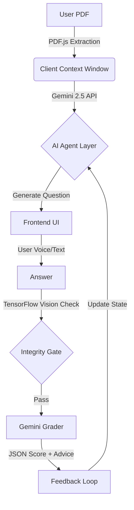

# ⚔️ LexiVitae AI: The Autonomous Viva Examiner
> **Team:** Fullstack Shinobi | **Event:** Kshitij 2026 Round 1 Winner


## 📖 The Problem
Traditional oral examinations (vivas) suffer from:
1.  **Subjectivity:** Bias based on the examiner's mood.
2.  **Scalability:** Impossible to viva 500+ students in one day manually.
3.  **Fatigue:** Human examiners lose precision after hour 2.

## 💡 The Solution: LexiVitae
LexiVitae is a **Zero-Shot AI Proctor & Examiner**. It ingests *any* raw research paper or textbook (PDF) and conducts a rigorous, semantic-grade oral interview in real-time.

### 🌟 Key Capabilities
*   **🧠 Semantic RAG Engine:** Doesn't just keyword match. It understands the *logic* of the uploaded PDF to ask "Why" and "How" questions.
*   **🗣️ Bi-Directional Voice Core:**
    *   **TTS:** Multi-tonal examiner voice (Empathetic for low scores, Strict for high scores).
    *   **STT:** Continuous, long-form speech recognition for detailed student answers.
*   **👁️ Shinobi Proctor:** Client-side TensorFlow.js vision detects:
    *   Multiple faces.
    *   Forbidden objects (Phones/Books).
    *   Tab switching.
*   **🎯 Adaptive Difficulty:**
    *   **Standard:** MCQs & Definitions.
    *   **Extreme:** Open-ended synthesis questions with strict grading.

## 🏗️ Architecture



## 🛠️ Tech Stack

| Domain | Technology | Why? |
| :--- | :--- | :--- |
| **Frontend** | Angular 19+ (Zoneless) | Maximum performance, no digest cycle overhead. |
| **AI Model** | Google Gemini 2.5 Flash | 1M context window allows full textbook ingestion. |
| **Vision** | TensorFlow.js (COCO-SSD) | Privacy-first, edge-based proctoring (no video upload). |
| **Styling** | Tailwind CSS | "Glassmorphism" Fluent UI design. |
| **Voice** | Web Speech API | Native browser support, zero-latency. |

## 🚀 Local Installation

1.  **Clone the Repository**
    ```bash
    git clone https://github.com/fullstack-shinobi/lexivitae.git
    cd lexivitae
    ```

2.  **Install Dependencies**
    ```bash
    npm install
    ```

3.  **Configure Environment**
    *   Create a `.env` file (or set system env variables).
    *   `API_KEY=your_google_gemini_api_key`

4.  **Run Application**
    ```bash
    npm start
    ```
    Navigate to `http://localhost:4200`.

## ☁️ Vercel Deployment

1.  Push to GitHub.
2.  Import to Vercel.
3.  **CRITICAL:** In Vercel Settings > Environment Variables, add `API_KEY`.
4.  Deploy.

## 🏆 Credits
**Architected by:** Fullstack Shinobi
*   **Lead Engineer:** Soumoditya Das
*   **AI Logic:** Gemini 2.5 Prompt Engineering
*   **UX Design:** Microsoft Fluent System

---
*Built for Kshitij 2026. This software is strictly for educational assessment benchmarking.*
